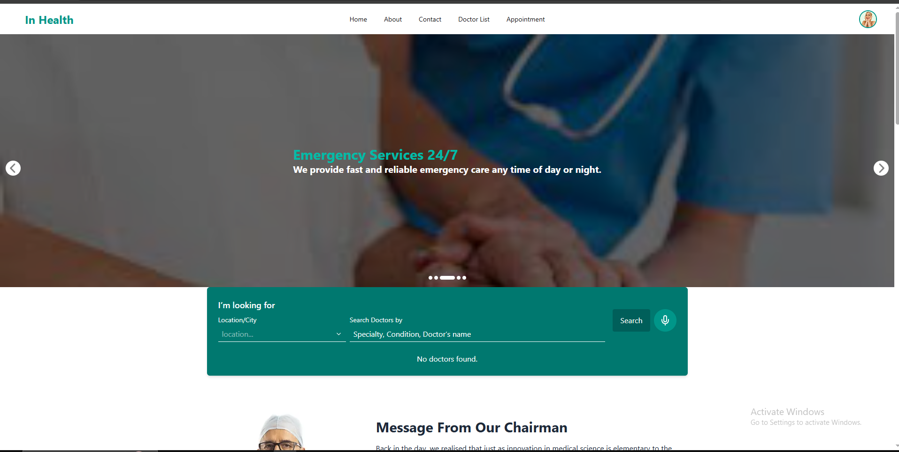
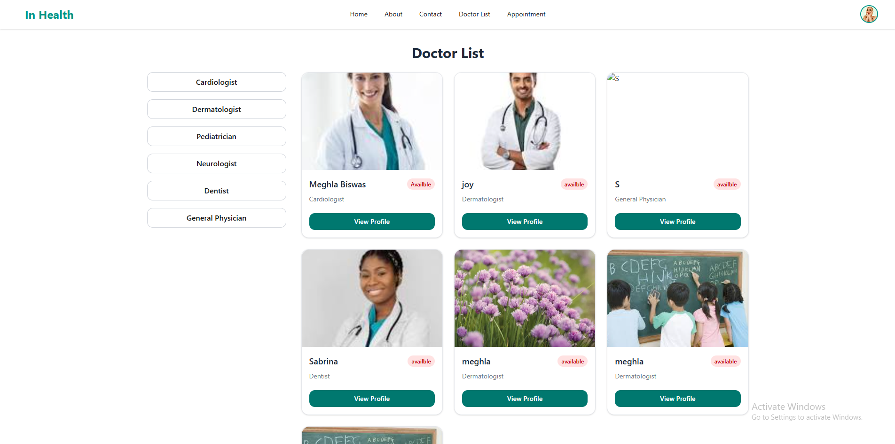

# 🏥 Hospital Management Frontend

A modern and responsive frontend web application built with **React.js** for managing hospital operations such as doctor listings, appointments, and user interactions. This is the frontend part of a complete hospital management system.

## 🚀 Live Site

👉 [Visit the Live Website](https://your-live-link.com)  
*(Replace this with your deployed link, e.g., Vercel/Netlify)*

---

## 📸 Screenshots

<!-- Add some images if available -->



---

## ⚙️ Features

- 👨‍⚕️ List of featured and available doctors
- 📅 Appointment scheduling UI
- 🔐 User authentication pages (login/register)
- 📱 Responsive design (mobile-first)
- 💬 Clean and interactive UI using Tailwind CSS / DaisyUI
- 🔄 Dynamic data fetching from backend API
- ✨ Modern UI animations using Framer Motion

---

## 🛠️ Tech Stack

| Tech            | Description                      |
|-----------------|----------------------------------|
| React.js        | Frontend JavaScript Framework    |
| Tailwind CSS    | Utility-first CSS Framework      |
| DaisyUI         | UI Component Library             |
| React Router    | Client-side Routing              |
| Axios / Fetch   | API Communication                |
| Framer Motion   | Animations                       |

---

## 🧩 Folder Structure
src/
├── assets/ # Images, logos
├── components/ # Reusable UI components
├── pages/ # Page-level components
├── routes/ # React Router setup
├── hooks/ # Custom hooks
├── App.jsx # Main app
├── main.jsx # Entry point


---

## 🧑‍💻 Getting Started

1. **Clone the repository**
```bash
git clone https://github.com/MeghlaB/hospital-management-frontend.git
cd hospital-management-frontend

2. **Install dependencies**

bash
npm install
3. **Run the project**

bash
npm run dev

3.**Visit on browser**

arduino
http://localhost:5173


